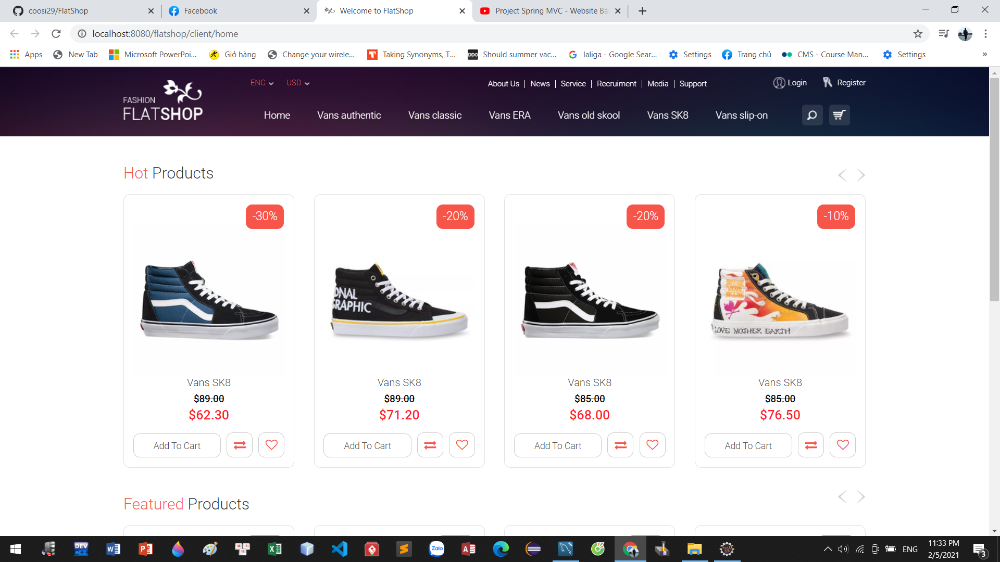
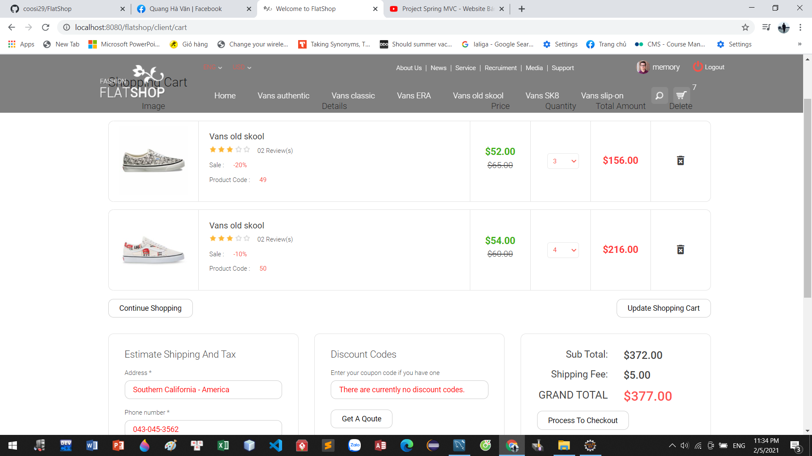
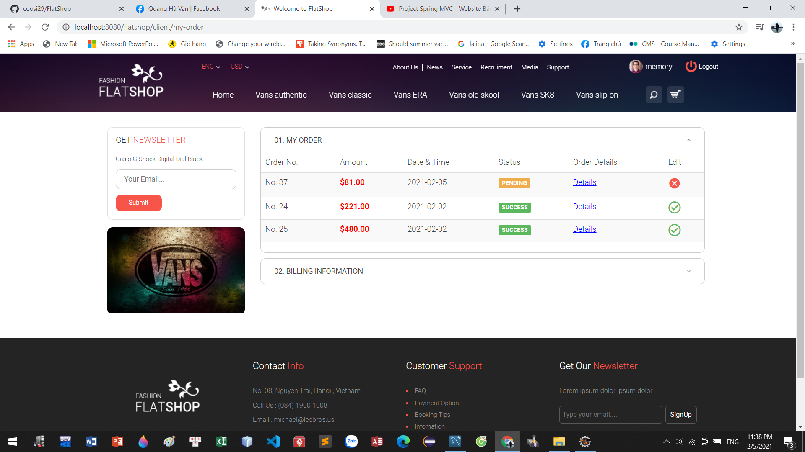
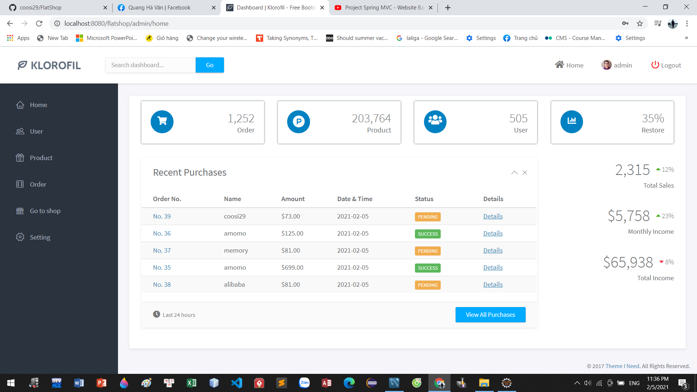

# FlatShop

 
<a href="#">FlatShop</a>

<h2>Information</h2>
Tech : Spring MVC , My SQL, Hibernate, Security, Spring Mail, HTML, CSS,... 
Data : ShopVans  

<h2>Installation</h2>
 <a href="https://github.com/quanghavan29/FlatShop">Download FlatShop Backend</a> 

 <h2>Video Demo</h2>
 <a href="https://www.youtube.com/watch?v=0si0qdsfBQI&t=1s">Video FlatShop Demo</a> 

<h2>Examples</h2>

<h2>Thank you for your interest in my project.</h2>
